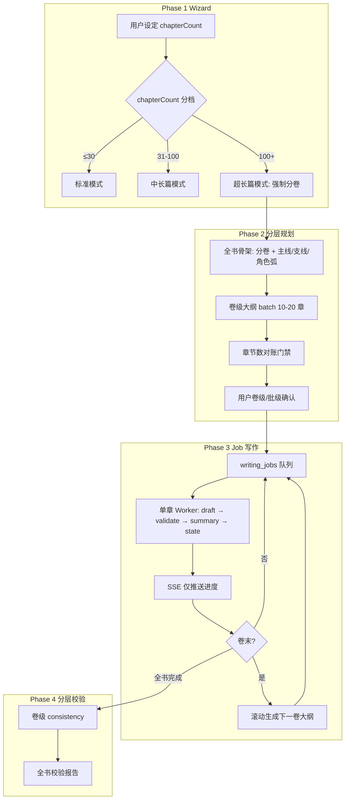
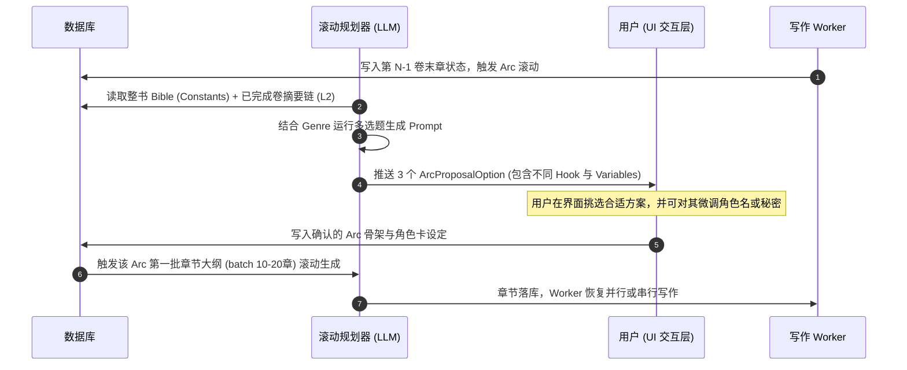

# 长篇小说（200+ 章）改造方案

> 文件路径：`docs/knowledge/long_novel_refactor_plan.md`  
> 版本：1.0.0 · 日期：2026-06-06  
> 状态：草案（待评审）  
> 关联文档：[novelist_workflow_analysis.md](./novelist_workflow_analysis.md)、[design.md](../spec/design.md)、[prompts-design.md](../spec/prompts-design.md)

---

## 1. 背景与目标

### 1.1 背景

当前 Story 项目已实现 Novelist Phase 0～4 的 Web 串行写作闭环（Wizard → Phase 2 规划 → SSE 流式写作 → 阅读/导出）。在 **20～50 章** 规模下运行良好；当用户设定 **200 章以上** 时，会在 **规划质量、上下文记忆、运行时可靠性、一致性校验** 四个层面同时失效。

TASK-021 已落地「出场人物过滤 + POV 边界 + 章节摘要链 + 上章结尾片段」，显著改善了中短篇连贯性，但 **未解决长篇规模下的结构性瓶颈**。
为了在生成 200+ 章的超长流程中，既能保证各个分卷故事的丰富、饱满与独立吸引力，又能确保整本书的一致性，系统引入了“多题材自适应分卷协同提案引擎”。每一卷既是一个完整、独立的奇案或冒险风波，又通过“铁打的核心主角与常驻配角”来锚定整本书的灵魂与一致性。

#### 核心设计理念

1. **不变量（Constants）**：主角及常驻核心配角在整本书中的性格、能力与底色保持绝对一致（静态角色卡维护于全局）。
2. **局部变量（Variables）**：每卷引入 2-3 个极具戏剧反差的专属配角，本卷结束后自动沉淀，不占用后续卷的上下文。
3. **悬疑引子（The Hook）**：每卷开篇必有一个不可能的悬疑谜题或核心危机，强力驱动读者兴趣。
4. **终极暗线咬合（Meta Link）**：卷末破案或危机解决时，吐露出一点点指向整书终极阴谋的碎片，保证卷与卷之间的递进。

### 1.2 改造目标

| 维度       | 现状                       | 目标                                  |
| ---------- | -------------------------- | ------------------------------------- |
| 规划       | 单次 LLM 输出全部 7 列表格 | 分层/分批/滚动规划，杜绝空洞与重复    |
| 写作上下文 | 全量摘要链拼接进 Prompt    | 滑动窗口 + 分卷摘要 + 可选 RAG        |
| 运行时     | 单 SSE 连接串行跑完全书    | 后台 Job 队列，一章一任务，可断点续写 |
| 一致性     | 章级字数 + 悬念校验        | Story State + 卷级/批级反重复门禁     |
| 产品       | 无长篇分档提示             | 按章节数自动启用「长篇模式」          |

### 1.3 非目标（本阶段不做）

- 子 Agent 并行写作（Novelist CLI 的 `subagent-parallel` 模式）—— 留作 Phase D 可选增强
- 向量数据库自建集群 —— Phase C 先用 pgvector 或外置 embedding 服务
- 改变现有短篇（≤30 章）用户的默认体验 —— 须向后兼容

---

## 2. 现状架构与瓶颈（结合代码）

### 2.1 关键模块映射

| 模块     | 路径                                     | 职责                                                 | 长篇瓶颈                   |
| -------- | ---------------------------------------- | ---------------------------------------------------- | -------------------------- |
| 规划     | `lib/writer/planner.ts`                  | 单次 `generateOutline` + `generateCharacterProfiles` | 200 章一次输出不可行       |
| 大纲解析 | `lib/writer/parse-outline.ts`            | Markdown 表格 → `chapters` 落库                      | 缺章/乱序容错低            |
| 上下文   | `lib/writer/context-memory.ts`           | 摘要链 + 上章 220 字 + 人物过滤                      | `summaryTimeline` 无界增长 |
| 写作引擎 | `lib/writer/generator.ts`                | 串行 draft → validate → summary                      | 内存保留全书 `content`     |
| 校验     | `lib/writer/validator.ts`                | 字数 + 悬念钩子                                      | 无跨章/反重复校验          |
| 流式服务 | `lib/novels/writing-service.ts`          | 单 SSE 内调用 `generateNovel`                        | 超时、断连、限流           |
| 配置     | `config/novel.ts`                        | 默认 20 章、字数 3000～8000                          | 无长篇分档                 |
| Prompt   | `prompts/instructions/phase2-outline.md` | 要求一次生成 `{{chapterCount}}` 章                   | 后段空洞、重复             |

### 2.2 已具备能力（TASK-021 及以前）

- ✅ 每章完成后 LLM 生成 `chapter_summary` 写入 `chapters.chapter_summary`
- ✅ 写前注入 POV 边界（`perspectiveBoundary`）
- ✅ 按大纲「出场人物」过滤 `characterProfiles`
- ✅ `resumeNovelWriting` 保留 `completed` 章，重置非完成章
- ✅ Plan 页可编辑单章 `outlineSummary`

### 2.3 核心问题清单

#### P0 · 上下文窗口溢出

```text
buildSummaryTimeline() → 拼接 ALL 已完成章节摘要
第 200 章 ≈ 200 × 400 字 ≈ 8 万字（仅摘要链）
+ outlineRow + 人物档案 + 系统指令 → 超出模型 context 或 lost-in-the-middle
```

同时 `loadCompletedChapterMemories()` 加载全部已完成章 `content`，Prompt 实际仅用上章末 220 字。

#### P0 · Phase 2 一次性 200 章大纲

- 输出 token 超限 → 截断、缺章、后段敷衍
- 「承接上章」列形式化 → 因果链弱、事件模式重复
- 无分卷/分幕结构 → 200 章只能用同一节奏模板填充

#### P0 · SSE 长跑不可完成

- `GET /api/novel/[id]/write/stream` 在单次 HTTP 生命周期内串行写完所有 pending 章
- 200 章 ≈ 600～800+ 次 LLM 调用，耗时数小时～数天
- 设计文档 AI 限流 60 次/小时/IP；Serverless 部署存在硬超时

#### P1 · 一致性与反重复不足

- `CharacterProfile` 仅 `name / role / summary`，无动态状态
- 无伏笔台账、无已用事件模式 registry
- 大纲批内/卷内无语义重复检测

#### P2 · 数据与 UI

- `getNovelWritingChapters` / `exportNovelMarkdown` 一次加载全书
- `resetNovelForWriting` 会清空全部章节 content

---

## 3. 目标架构

### 3.1 总体流程（长篇模式）



### 3.2 分层上下文模型（写每一章时注入）

| 层级    | 内容                                    | 来源                                   | 估计 token |
| ------- | --------------------------------------- | -------------------------------------- | ---------- |
| L0 固定 | 题材/冲突/视角/本书 POV 规则            | `novels.core_config` / `custom_config` | 小         |
| L1 卷级 | 当前卷目标、卷内悬念线、卷摘要          | `novel_arcs` / `arc_summaries`         | 中         |
| L2 滑动 | 最近 N 章完整摘要（N=5～10，可配置）    | `chapters.chapter_summary`             | 中         |
| L3 衔接 | 上一章结尾 220 字                       | 上一章 `content` 末段                  | 小         |
| L4 本章 | 7 列 `outline_summary` + 过滤后人物档案 | `chapters` / `novel_profiles`          | 中         |
| L5 状态 | Story State 快照（角色/伏笔/已用套路）  | `story_state`                          | 中         |
| L6 可选 | RAG 检索相关历史片段                    | embedding 索引                         | 按需       |

**原则**：Prompt 总上下文有硬上限（如 12k～24k token），各层按优先级裁剪，**永不**全量拼接 200 章摘要。

### 3.3 分层规划模型（解决空洞与重复）

| 层级 | 输出                                    | LLM 调用粒度 | 人工确认点 |
| ---- | --------------------------------------- | ------------ | ---------- |
| 全书 | 分卷结构、主线/支线、角色弧、终极揭秘   | 1 次         | 可选       |
| 卷   | 本卷 20～40 章、卷高潮章、卷内伏笔表    | 每卷 1 次    | **推荐**   |
| 批   | 10～20 章 7 列表格                      | 每批 1 次    | 可选       |
| 滚动 | 基于已完成摘要 + story_state 生成下一卷 | 卷末触发     | 推荐       |

**反重复约束**（写入每批 Prompt）：

- 显式传入「前批已用事件模式」列表，要求本批不得重复
- 悬念钩子类型连续使用 ≤2 章
- 本批须推进 1 个主线里程碑 + 1 个角色状态变化

**批后质检**（规则 + 可选小模型）：

- 相邻章「核心事件」语义相似度 > 阈值 → 自动重写该批
- 解析章数 ≠ 预期 → 阻断，不进入写作

### 3.4 模块化分卷提案引擎

为了在生成 200+ 章的超长流程中，既能保证各个分卷故事的丰富、饱满与独立吸引力，又能确保整本书的一致性，系统引入了“多题材自适应分卷协同提案引擎”。每一卷既是一个完整、独立的奇案或冒险风波，又通过“铁打的核心主角与常驻配角”来锚定整本书的灵魂与一致性。

#### 3.4.1 核心设计理念

1. **不变量（Constants）**：主角及常驻核心配角在整本书中的性格、能力与底色保持绝对一致（静态角色卡维护于全局）。
2. **局部变量（Variables）**：每卷引入 2-3 个极具戏剧反差的专属配角，本卷结束后自动沉淀，不占用后续卷的上下文。
3. **悬疑引子（The Hook）**：每卷开篇必有一个不可能的悬疑谜题或核心危机，强力驱动读者兴趣。
4. **终极暗线咬合（Meta Link）**：卷末破案或危机解决时，吐露出一点点指向整书终极阴谋的碎片，保证卷与卷之间的递进。

#### 3.4.2 局部变量与全局不变量的加载隔离

- **不变量存储**：全局不变量（常驻人物）持久化于全局的 `novel_profiles` 表，仅由每章大纲的“出场人物”进行关系过滤并注入 Prompt。
- **局部变量存储**：各分卷专属角色（如古龙式临时配角）不写入全局 `novel_profiles`，而是以 JSONB 格式隔离存储在当前所属卷的 `novel_arcs.variables` 字段中。
- **写作时上下文合并**：`lib/writer/context-memory.ts` 在加载该卷对应章节的上下文时，会同时读取 `novel_profiles`（过滤后）与当前卷的 `novel_arcs.variables` 进行合并；进入下一卷后，随着当前所属卷 ID 变更，旧卷专属角色将物理隔离并自然沉淀为小说背景历史，绝不污染后文写作。

#### 3.4.3 多题材映射矩阵

根据用户在 Wizard 阶段选择的题材，系统将通用概念自适应映射为对应的文学修辞：

| 题材     | 奇诡引子 (Hook)             | 舞台与环境              | 常驻角色调度 (Constants)     | 卷内专属新人物 (Variables)       | 冲突爆发与反转 (Twist)      | 终极暗线扣合 (Meta Link) |
| -------- | --------------------------- | ----------------------- | ---------------------------- | -------------------------------- | --------------------------- | ------------------------ |
| **武侠** | 江湖奇案 / 秘宝传闻         | 江南烟雨 / 关外大漠     | 浪子游侠 + 独臂刀客 / 尼姑   | 隐世高手 / 邪派刺客 / 异国公主   | 挚友背叛 / 幕后黑手露出     | 发现“青龙会”令牌         |
| **悬疑** | 密室杀人 / 连环悬案         | 孤岛别墅 / 暴风雪山庄   | 盲眼侦探 + 女法医 / 助手     | 嫌疑人 / 伪证者 / 关键线人       | 诡计揭秘 / 帮凶是身边的警长 | 指向“蛇之环”犯罪集团     |
| **科幻** | 重力异常 / 废弃飞船信号     | 世代飞船 / 边境星区     | 探险船长 + 冷酷AI / 机械师   | 史前硅基生命 / 狂热物理学家      | 物理灾难机制暴露 / 人性抉择 | 揭示“帝国审判庭”秘密坐标 |
| **都市** | 恶意做空危机 / 核心机密泄露 | 跨国投行 / 科技研发中心 | 霸道总裁 + 天才精算师 / 秘书 | 幽灵操盘手 / 叛逆技术天才        | 多空大战反击 / 商业间谍现形 | 触及“盛天集团”陈年命案   |
| **言情** | 契约婚约波折 / 假戏真做风波 | 时尚集团 / 豪门社交圈   | 女主 + 傲娇契约丈夫 / 闺蜜   | 白月光情敌 / 桀骜画师 / 偏执长辈 | 误会冰释 / 隐藏身份的曝光   | 揭开“林氏二叔”夺权阴谋   |

#### 3.4.4 分卷提案接口定义（JSON Schema）

```typescript
export interface ArcProposalOption {
  optionId: string; // 方案 ID
  title: string; // 建议的卷名
  hook: string; // 开篇悬疑/引子
  location: string; // 本卷舞台
  constantsUsed: {
    // 常驻角色在此卷中的具体定位
    characterName: string;
    roleInThisArc: string;
  }[];
  variablesIntroduced: {
    // 卷内专属新人物设定
    name: string;
    archetype: string; // 角色原型
    traits: string; // 核心性格及反差设定
    secret: string; // 隐藏秘密或真实动机
  }[];
  climaxAndTwist: string; // 本卷高潮与核心反转
  metaPlotLink: string; // 终极主线衔接机制
}
```

#### 3.4.5 分卷提案生成与人机协同工作流



---

## 4. 数据模型改造

### 4.1 新增表（建议）

#### `novel_arcs` — 分卷/故事弧

| 字段                        | 类型      | 说明                                                          |
| --------------------------- | --------- | ------------------------------------------------------------- |
| `id`                        | uuid PK   |                                                               |
| `novel_id`                  | uuid FK   |                                                               |
| `arc_number`                | int       | 卷序号，从 1 开始                                             |
| `title`                     | varchar   | 卷名                                                          |
| `chapter_start`             | int       | inclusive                                                     |
| `chapter_end`               | int       | inclusive                                                     |
| `arc_goal`                  | text      | 本卷核心目标                                                  |
| `hook`                      | text      | 本卷开篇奇诡引子（自 3.4.5 提案落库）                         |
| `location`                  | varchar   | 本卷核心故事舞台                                              |
| `variables`                 | jsonb     | 本卷专属临时人物包（`variablesIntroduced`）                   |
| `climax_and_twist`          | text      | 本卷核心冲突与反转                                            |
| `meta_plot_link`            | text      | 终极暗线契合线索                                              |
| `arc_summary`               | text      | 卷级滚动摘要（写作过程中更新）                                |
| `status`                    | varchar   | `planned` / `writing` / `completed` / `wait_plan`（等待规划） |
| `created_at` / `updated_at` | timestamp |                                                               |

#### `story_state` — 结构化故事状态（JSONB）

| 字段             | 类型      | 说明               |
| ---------------- | --------- | ------------------ |
| `id`             | uuid PK   |                    |
| `novel_id`       | uuid FK   |                    |
| `chapter_number` | int       | 截至该章的状态快照 |
| `state`          | jsonb     | 见下方 Schema      |
| `created_at`     | timestamp |                    |

`state` JSON 建议结构：

```json
{
  "characters": [
    {
      "name": "林云",
      "location": "...",
      "goal": "...",
      "knows": ["..."],
      "relationships": {}
    }
  ],
  "openThreads": [
    { "id": "thread-1", "description": "...", "plantedAt": 12, "dueBy": 45 }
  ],
  "usedPatterns": ["调查-遇险-逃脱", "..."],
  "resolvedThreads": ["..."]
}
```

#### `writing_jobs` — 写作任务队列

| 字段                        | 类型      | 说明                                           |
| --------------------------- | --------- | ---------------------------------------------- |
| `id`                        | uuid PK   |                                                |
| `novel_id`                  | uuid FK   |                                                |
| `chapter_number`            | int       |                                                |
| `status`                    | varchar   | `pending` / `running` / `completed` / `failed` |
| `attempt`                   | int       | 重试次数                                       |
| `locked_at`                 | timestamp | Worker 锁                                      |
| `error_message`             | text      |                                                |
| `created_at` / `updated_at` | timestamp |                                                |

唯一索引：`(novel_id, chapter_number)` 活跃 Job。

#### `outline_batches` — 分批大纲（可选，便于对账与重试）

| 字段                            | 类型      | 说明                        |
| ------------------------------- | --------- | --------------------------- |
| `id`                            | uuid PK   |                             |
| `novel_id`                      | uuid FK   |                             |
| `arc_number`                    | int       |                             |
| `batch_index`                   | int       | 卷内批次                    |
| `chapter_start` / `chapter_end` | int       |                             |
| `raw_output`                    | text      | LLM 原始输出                |
| `parse_status`                  | varchar   | `ok` / `failed` / `partial` |
| `created_at`                    | timestamp |                             |

### 4.2 现有表扩展

#### `novels.custom_config` 扩展字段

```typescript
type CustomConfig = {
  // ...existing
  chapterCount: number;
  /** 新增 */
  novelScale?: "standard" | "medium" | "long"; // 自动推导或用户确认
  volumeCount?: number; // 分卷数
  autoPolish?: boolean; // 可选自动润色
};
```

#### `chapters` 可选扩展

- `arc_number` int — 所属卷（冗余，便于查询）
- `batch_id` uuid — 所属规划批次

### 4.3 迁移策略

1. 新增 migration，**不破坏**现有 `chapters` 数据
2. `chapterCount ≤ 30` 的旧作品：`novelScale = standard`，行为不变
3. `chapterCount > 30`：Wizard 提示升级长篇模式，补跑 `novel_arcs` 拆分（可选手动触发）

---

## 5. 配置集中管理（`config/`）

新增 `config/long-novel.ts`：

```typescript
/** 章节数分档阈值 */
export const NOVEL_SCALE_THRESHOLDS = {
  standardMax: 30,
  mediumMax: 100,
} as const;

/** 上下文滑动窗口 */
export const CONTEXT_RECENT_CHAPTER_WINDOW = 8;

/** 分卷默认值 */
export const DEFAULT_CHAPTERS_PER_ARC = 30;
export const OUTLINE_BATCH_SIZE = 15;

/** Prompt token 预算（字符近似或 tiktoken） */
export const PROMPT_BUDGET_CHARS = 48_000;

/** Job Worker */
export const WRITING_JOB_MAX_ATTEMPTS = 3;
export const WRITING_JOB_LOCK_TTL_MS = 600_000;

/** 反重复 */
export const OUTLINE_SIMILARITY_THRESHOLD = 0.75;
```

限流改造（`design.md` 对齐）：

- 短篇：维持现有 per-IP 策略
- 长篇：改为 **per-user 每日章数配额** + Job 队列节流，避免 60 次/小时卡死长跑

---

## 6. 模块改造明细

### 6.1 Phase 2 · `lib/writer/planner.ts`

| 改动                                  | 说明                                                          |
| ------------------------------------- | ------------------------------------------------------------- |
| 新增 `runPhase2PlanningLong()`        | 长篇入口，替代单次 `generateOutline`                          |
| 新增 `generateBookSkeleton()`         | 全书分卷 + 悬念线 + 角色弧（Prompt: `phase2-book-skeleton`）  |
| 新增 `generateArcOutlineBatch()`      | 按卷、按批生成 7 列表格（Prompt: `phase2-arc-outline-batch`） |
| 新增 `reconcileChapterCount()`        | 解析结果与 `chapterCount` 对账                                |
| 新增 `checkOutlineBatchDuplication()` | 批内/批间语义重复检测                                         |
| 保留 `generateOutline()`              | 作为 `standard` 模式快捷路径                                  |

**Plan API 变更**：

- `POST confirm-title` 流式规划时，根据 `chapterCount` 分支调用 standard / long 流程
- 新增 `POST /api/novel/[id]/plan/arc` — 卷级确认
- 新增 `POST /api/novel/[id]/plan/batch` — 触发下一批大纲（滚动规划）

### 6.2 Phase 3 · `lib/writer/context-memory.ts`

| 改动                              | 说明                                                                       |
| --------------------------------- | -------------------------------------------------------------------------- |
| 重构 `buildSummaryTimeline()`     | 改为 `buildLayeredNarrativeContext()`                                      |
| 新增 `buildRecentSummaryWindow()` | 最近 N 章                                                                  |
| 新增 `buildArcSummaryLayer()`     | 当前卷摘要                                                                 |
| 新增 `loadStoryStateSnapshot()`   | 读取 L5 状态                                                               |
| 新增 `loadArcVariables()`         | 读取当前所属 `novel_arcs.variables` 并与全局人物卡合并，本卷结束后自然沉淀 |
| 修改数据加载                      | 不再 SELECT 全书 `content`；上章 excerpt 单独查询                          |

### 6.3 Phase 3 · `lib/writer/generator.ts`

| 改动                           | 说明                                               |
| ------------------------------ | -------------------------------------------------- |
| 拆出 `generateSingleChapter()` | 单章幂等，供 Worker 调用                           |
| 章完成后                       | 调用 `extractStoryStateDelta()` 更新 `story_state` |
| 移除内存中全书 `content` 累积  | 仅 push 摘要元数据                                 |
| 卷末钩子                       | 触发 `planNextArcIfNeeded()`                       |

### 6.4 运行时 · 新增 `lib/writer/job-runner.ts`

```text
poll writing_jobs WHERE status=pending
→ 加锁 → generateSingleChapter()
→ 成功:
    1. 更新 chapters 状态为 completed
    2. 判断是否到当前卷末 (chapter_number === arc.chapter_end)
       - 否: enqueue next chapter (chapter_number + 1) 并入队 pending 任务
       - 是:
         - 触发 planNextArcIfNeeded()
         - 广播 SSE 'planning_required' 事件
         - 将小说写作状态设为 'wait_plan'，挂起队列等待用户确认新卷提案
→ 失败: attempt++ ，超限则 failed
```

部署选项：

- **A（推荐）**：独立 Node Worker 进程 + Postgres Job 表
- **B**：Vercel Cron + `maxDuration` 分段（每 tick 处理 1 章）
- **C**：Inngest / BullMQ（若引入 Redis）

### 6.5 Phase 3 · `lib/novels/writing-service.ts`

| 改动         | 说明                                                   |
| ------------ | ------------------------------------------------------ |
| SSE 职责收缩 | 订阅 Job 进度事件，不再 inline 跑 `generateNovel` 全书 |
| 新增事件     | `job_enqueued`, `arc_complete`, `planning_required`    |
| 断连恢复     | 前端重连 SSE 即可恢复进度，Worker 独立于连接           |

### 6.6 Phase 4 · `lib/writer/validator.ts`

| 改动                            | 说明                                             |
| ------------------------------- | ------------------------------------------------ |
| 保留现有章级校验                | 字数 + 悬念                                      |
| 新增 `validateArcConsistency()` | 卷末批量校验（Prompt: `phase4-arc-consistency`） |
| 新增 `validateOutlineBatch()`   | 规划阶段反重复                                   |

### 6.7 Prompts 新增清单

| Prompt ID                    | 用途                          |
| ---------------------------- | ----------------------------- |
| `phase2-book-skeleton`       | 全书分卷骨架                  |
| `phase2-arc-outline-batch`   | 分批 7 列大纲（含反重复约束） |
| `phase2-rolling-arc-plan`    | 卷末滚动生成下一卷            |
| `phase3-story-state-extract` | 章后提取 state delta          |
| `phase4-arc-consistency`     | 卷级一致性报告                |
| `phase4-outline-dedup-check` | 大纲批重复检测                |

模板更新：`docs/novelist/references/guides/outline-template.md` 增加「100+ 章请使用分卷模板」说明。

### 6.8 UI 改造要点

| 页面      | 改动                                          |
| --------- | --------------------------------------------- |
| Wizard Q8 | `chapterCount > 100` 显示长篇提示、推荐分卷数 |
| Plan      | 卷级 Tab + 批级大纲预览 + 重复检测报告        |
| Write     | 显示当前卷/Job 队列状态；SSE 断连可恢复       |
| Read      | 章节侧栏虚拟滚动；正文 lazy load              |
| Export    | 流式导出或异步生成下载链接                    |

---

## 7. 分阶段实施计划

### Phase A · 能跑通（P0，约 2～3 周）

**目标**：200 章不会因 context 溢出或 SSE 超时整体失败。

| 任务              | 交付物                                                             |
| ----------------- | ------------------------------------------------------------------ |
| A1 配置分档       | `config/long-novel.ts`，Wizard 提示                                |
| A2 滑动窗口上下文 | 重构 `context-memory.ts`，单测覆盖第 100/200 章 Prompt 长度        |
| A3 查询优化       | `loadCompletedChapterMemories` 不加载全书 content                  |
| A4 Job 队列 MVP   | `writing_jobs` 表 + `job-runner.ts` + 单章 `generateSingleChapter` |
| A5 SSE 改造       | `writing-service.ts` 订阅 Job 进度                                 |
| A6 限流调整       | 长篇 per-user 配额                                                 |

**验收**：

- 模拟 200 章 Mock LLM：Prompt 字符数稳定在预算内
- 中断 SSE 后重连，Worker 继续处理 pending 章
- 已完成章不被重复生成

### Phase B · 能写好（P0 规划 + P1 反重复，约 2～3 周）

**目标**：大纲不空洞、批内不重复。

| 任务                | 交付物                                        |
| ------------------- | --------------------------------------------- |
| B1 全书骨架         | `generateBookSkeleton` + `novel_arcs`         |
| B2 分批大纲         | `generateArcOutlineBatch` + `outline_batches` |
| B3 章节对账         | `reconcileChapterCount` 阻断缺章              |
| B4 反重复质检       | `checkOutlineBatchDuplication`                |
| B5 Plan UI 卷级确认 | `plan-dashboard` 扩展                         |

**验收**：

- 200 章作品规划阶段解析出 200 行且无缺章
- 自动检测报告批内高相似度章对并重试后下降
- 用户可在卷级暂停/修改后再开写

### Phase C · 能连贯（P1 一致性，约 2 周）

**目标**：200 章人设/伏笔可追踪。

| 任务                            | 交付物                                |
| ------------------------------- | ------------------------------------- |
| C1 story_state 表 + 提取 Prompt | 每章完成后更新                        |
| C2 卷级 consistency 校验        | 卷末自动运行                          |
| C3 滚动卷规划                   | 卷末 `phase2-rolling-arc-plan`        |
| C4 可选 RAG                     | pgvector 或外置 embedding（低优先级） |

### Phase D · 体验与成本（P2，约 1～2 周）

| 任务                      | 交付物              |
| ------------------------- | ------------------- |
| D1 Read/Export 分页与流式 | 性能达标            |
| D2 可选 autoPolish        | 对接 `polish.ts`    |
| D3 成本分档提示           | Wizard + 写作前预估 |
| D4 卷间有限并行（可选）   | 需严格批次隔离      |

---

## 8. 测试策略（TDD 对齐 AGENTS.md）

| 层级        | 范围                                                                     | 工具        |
| ----------- | ------------------------------------------------------------------------ | ----------- |
| Unit        | `context-memory` 窗口化、`reconcileChapterCount`、Job 状态机、反重复规则 | Vitest      |
| Integration | Plan long flow API、Job enqueue/dequeue、resume 幂等                     | Vitest + DB |
| E2E         | 30 章标准模式回归不变；50 章长篇模式卷级确认 → 写 5 章 → 断连恢复        | Playwright  |

**禁止伪造 PASS**：200 章全量 E2E 不现实，用 Mock LLM + 属性测试（Prompt 长度、章数对账）替代。

建议新增测试文件：

- `lib/writer/context-memory.long.test.ts`
- `lib/writer/planner-long.test.ts`
- `lib/writer/job-runner.test.ts`
- `lib/writer/outline-dedup.test.ts`

---

## 9. 向后兼容与迁移

| 场景                                           | 行为                                                                         |
| ---------------------------------------------- | ---------------------------------------------------------------------------- |
| 已有作品 `chapterCount ≤ 30`                   | 完全走现有 `generateOutline` + `generateNovel` 路径（可配置开关切 Job 模式） |
| 已有作品 `chapterCount > 30` 且已落库 chapters | 提供「升级长篇模式」管理动作：拆分 arcs、保留已有 completed 章               |
| `resetNovelForWriting`                         | 改为仅重置非 completed 章；completed 默认保留                                |
| SSE 旧客户端                                   | 保持事件名兼容，新增事件为 additive                                          |

---

## 10. 风险与缓解

| 风险                  | 影响         | 缓解                                           |
| --------------------- | ------------ | ---------------------------------------------- |
| Job Worker 部署复杂度 | 延迟上线     | Phase A 先用 DB polling + Cron，后续再独立进程 |
| 分批规划增加 LLM 成本 | 用户费用上升 | 骨架用小模型，正文用大模型；Wizard 展示预估    |
| story_state 提取不准  | 错误约束写偏 | state 仅作软约束；卷级人工确认                 |
| RAG 引入噪声          | 召回无关片段 | Phase C 可选；先滑动窗口 + 卷摘要              |
| 改造面大              | 回归短篇     | `novelScale` 分支 + 全量短篇 E2E 回归          |

---

## 11. 成功指标

| 指标                          | 标准模式 baseline | 长篇模式目标                   |
| ----------------------------- | ----------------- | ------------------------------ |
| 200 章规划解析完整率          | N/A（当前常失败） | ≥ 99%                          |
| 第 150 章 Prompt 摘要层字符数 | 无界增长          | ≤ `PROMPT_BUDGET_CHARS` 的 40% |
| 写作 24h 内断连可续           | 不稳定            | 100% 幂等续写                  |
| 批内重复章对率（自动检测）    | 未测              | < 5%，卷末 < 2%                |
| 短篇（20 章）E2E 回归         | PASS              | PASS（无回归）                 |

---

## 12. 建议 TASK 拆分（供 `docs/spec/tasks.md` 引用）

| TASK ID  | 名称                             | 阶段 | 依赖               |
| -------- | -------------------------------- | ---- | ------------------ |
| TASK-023 | 长篇配置分档与 Wizard 提示       | A    | —                  |
| TASK-024 | 滑动窗口上下文 + 查询优化        | A    | —                  |
| TASK-025 | writing_jobs 表与单章 Job Runner | A    | TASK-024           |
| TASK-026 | SSE 进度订阅改造                 | A    | TASK-025           |
| TASK-027 | 长篇限流策略                     | A    | TASK-025           |
| TASK-028 | 全书骨架与 novel_arcs            | B    | TASK-023           |
| TASK-029 | 分批大纲生成与对账               | B    | TASK-028           |
| TASK-030 | 大纲反重复质检                   | B    | TASK-029           |
| TASK-031 | Plan 页卷级确认 UI               | B    | TASK-029           |
| TASK-032 | story_state 提取与注入           | C    | TASK-024           |
| TASK-033 | 卷级 consistency 校验            | C    | TASK-032           |
| TASK-034 | 滚动卷规划                       | C    | TASK-029, TASK-033 |
| TASK-035 | Read/Export 分页与流式           | D    | —                  |
| TASK-036 | 可选 autoPolish 开关             | D    | TASK-025           |

---

## 13. 附录：与现有分析文档的关系

- [novelist_workflow_analysis.md](./novelist_workflow_analysis.md) 中的 Gap 1～3（人物全量加载、slice(-500)、POV 约束）—— **Gap 1/3 已由 TASK-021 部分修复**；本方案在此基础上解决 **规模扩展** 与 **规划质量** 问题。
- 本方案将「一次性 200 章大纲导致空洞重复」明确为 **Phase B** 核心交付，并通过 **滚动卷规划** 避免「开局空想全书」。

---

## 变更记录

| 日期       | 版本  | 变更                                           |
| ---------- | ----- | ---------------------------------------------- |
| 2026-06-06 | 1.0.0 | 初稿：基于代码库现状与 200+ 章分析结论         |
| 2026-06-06 | 1.1.0 | 增加古龙式多题材自适应分卷协同提案引擎设计方案 |
