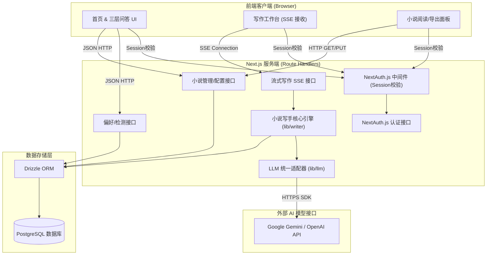

# 技术设计概览（Design）

> 文件路径：`docs/spec/design.md`
> 版本：1.0.0 · 日期：2026-05-29
> 状态：已定稿

---

## 项目结构

```
e:/NextCloud/coding/netx.js/story/
├── app/                           # Next.js App Router
│   ├── api/                       # API Route Handlers
│   │   ├── auth/                  # NextAuth.js 路由 ([...nextauth]/route.ts)
│   │   ├── preferences/           # 偏好与续写检测接口
│   │   └── novel/
│   │       ├── wizard/            # POST 创建 draft（Layer1 后）
│   │       └── [id]/
│   │           ├── wizard/        # PATCH 增量 custom_config
│   │           ├── wizard/suggest/
│   │           ├── wizard/confirm-config/
│   │           ├── wizard/titles/
│   │           ├── confirm-title/
│   │           ├── plan/
│   │           └── write/stream/
│   ├── novel/
│   │   ├── create/                # 三层问答表单页面
│   │   └── [id]/
│   │       ├── plan/              # 大纲预览确认页面
│   │       ├── write/             # 写作工作台页面
│   │       └── read/              # 阅读与编辑页面
│   ├── login/                     # 登录页面
│   ├── globals.css                # 全局样式
│   ├── layout.tsx                 # 根布局
│   └── page.tsx                   # 首页（快捷入口/未完成项目卡片）
├── components/                    # UI 组件
│   ├── novel-wizard/              # 渐进式披露向导（逐题，对齐 phase1-layer*.md）
│   │   ├── WizardShell.tsx
│   │   ├── QuestionStep.tsx
│   │   ├── LayerSummary.tsx
│   │   ├── ConfigReview.tsx
│   │   └── TitlePicker.tsx
│   ├── OutlineCard.tsx            # 大纲编辑卡片
│   ├── StreamTerminal.tsx         # 流式写作终端面板
│   └── ui/                        # 原子 UI 组件（按钮、对话框等）
├── db/                            # 数据库与 Drizzle 配置
│   ├── index.ts                   # 数据库客户端连接
│   └── schema.ts                  # Drizzle ORM Schema
├── docs/                          # 文档库
│   ├── spec/                      # SDD 规格文档
│   └── novelist/                  # 小说助手逻辑规范
├── prompts/                       # LLM 提示词与输出模版（对齐 docs/novelist）
│   ├── system/                    # 全局角色 System Instruction
│   ├── instructions/              # 分阶段 User Prompt（含 {{变量}}）
│   ├── templates/                 # 大纲/人物/章节/导出 Markdown 骨架
│   └── fragments/                 # 黄金法则、钩子等可注入摘录
├── lib/                           # 核心服务与工具
│   ├── auth.ts                    # NextAuth.js 配置
│   ├── llm.ts                     # 大模型（Gemini/OpenAI 兼容）通用适配器
│   ├── prompts/                   # 读取 prompts/ 并渲染变量
│   │   └── loader.ts
│   └── writer/                    # 小说创作流程核心逻辑（调用 lib/prompts，不内嵌 Prompt）
│       ├── planner.ts             # Phase 2：大纲与人设（两次 LLM）解析
│       ├── generator.ts           # Phase 3/4：串行初稿 + 校验重试
│       ├── polish.ts              # 用户选区手动润色（非自动流）
│       └── validator.ts           # 字数与悬念检测
├── drizzle.config.ts              # Drizzle 迁移配置
├── package.json                   # 项目依赖
└── tsconfig.json                  # TS 配置
```

---

## 架构概览

系统使用 **Next.js + Postgres + Drizzle ORM + NextAuth.js** 架构。所有页面默认由 NextAuth.js 中间件进行登录态保护，小说数据实现物理用户隔离。AI 小说创作模块使用纯串行执行控制流，并在后端生成中提供故障自愈校验；一旦遭遇物理异常，后端会将任务状态标记为挂起并输出日志，由前端展现重试控制。

### 系统架构图



### 核心数据流（以写作流故障暂停与重试为例）

```mermaid
sequenceDiagram
    autonumber
    actor User as 用户
    participant WS as 写作工作台 UI
    participant SSE as SSE 写入路由 (/api/novel/[id]/write/stream)
    participant ENG as 写作引擎 (writer/generator)
    participant LLM as LLM 适配器
    participant DB as Postgres (Drizzle)

    User->>WS: 点击 "开始自动写作"
    WS->>SSE: 建立 EventSource 连接 (携带 Session Cookie)
    SSE->>ENG: 启动写作任务 (串行模式，验证拥有者)
    ENG->>DB: 读取当前未完成章节的大纲信息
    DB-->>ENG: 返回本章大纲
    ENG->>SSE: 推送 "chapter_start" 事件

    rect rgb(30, 20, 20)
        note right of ENG: 异常场景：调用 LLM 网络超时或重试3轮均字数不达标
        ENG->>LLM: 发起正文生成请求 (发生错误)
        LLM-->>ENG: 返回连接超时 / 错误 (HTTP 500)
        ENG->>DB: 更新该 chapter 和 novel 状态为 'failed'，记录错误日志
        ENG->>SSE: 推送 "validation_result" (诊断错误报告)
        ENG-->>SSE: 中断当前 SSE 通道连接
    end

    WS-->>User: 界面高亮报错信息，解锁显示 "重试本章写作" 按钮

    User->>WS: 点击 "重试本章写作"
    WS->>SSE: 重新建立 EventSource 连接
    SSE->>ENG: 从失败章节重新启动写作任务
    ENG->>DB: 重置章节状态为 'pending'，重试计数清零
    ENG->>LLM: 重新发起正文生成请求
    LLM-->>ENG: 成功返回 Chunk 流
    ENG->>SSE: 推送 "content_chunk" ... 恢复正常写作
```



---

## 技术选型

| 技术           | 选型                            | 选型理由                                                                                                                  |
| -------------- | ------------------------------- | ------------------------------------------------------------------------------------------------------------------------- |
| **开发框架**   | Next.js 14+ (App Router)        | 支持混合渲染，Route Handlers 原生提供，便于编写长连接 SSE 接口。                                                          |
| **认证方案**   | NextAuth.js (Auth.js)           | Next.js 生态中最成熟的认证库，与 Drizzle ORM 无缝集成，开箱即用支持 Email (无密码魔法链接/凭据模式) 和主流 OAuth 提供商。 |
| **样式方案**   | Tailwind CSS + Vanilla CSS 动效 | 适合快速开发暗黑磨砂玻璃的 WOW 界面，动画扩展性极佳。                                                                     |
| **数据库 ORM** | Drizzle ORM                     | 原生支持 NextAuth.js adapter 数据库架构，极速 SQL 查询，端到端类型安全。                                                  |
| **测试框架**   | Vitest                          | 运行极快、自带 Mock 功能、对 TypeScript 原生支持。                                                                        |
| **UI 自动化**  | Playwright                      | 提供完整的无头浏览器交互测试以及界面回归截图能力。                                                                        |

---

## 测试工具选型

- **单元测试 / 接口测试**：Vitest
- **Web UI & E2E 测试**：Playwright

---

## 安全性

### 1. 认证与数据隔离

- 引入 NextAuth.js 中间件保护路由。任何非公共路由请求在服务端校验 `session` 令牌，在查询数据库时，强行加上 `user_id = session.user.id` 条件，实现物理数据隔离。

### 2. 接口限流 (Rate Limiting)

- 写入和 AI 请求的路由统一经过基于内存的限流：
  - 核心 AI 生成接口：同一 IP 60 次/小时限制。
  - 普通查询接口：同一 IP 200 次/小时限制。

### 3. API 密钥与环境变量管理

- 敏感配置一律写入项目根目录下的 `.env.local`。
- 包含 `DATABASE_URL`，`NEXTAUTH_SECRET`，`GEMINI_API_KEY` 等。

---

## Novelist 流程与 Prompts 对齐

作品生成逻辑须遵循 `docs/novelist/SKILL.md` 定义的阶段（Phase 0～4），Web 端仅实现**串行写作**模式。各阶段 LLM 指令与 Markdown 输出模版存放在 `prompts/`，由 `lib/prompts/loader.ts` 加载并注入 `core_config` / `custom_config` / 章节上下文变量。

阶段映射、**渐进式披露**、目录结构、Gap 分析与任务拆分详见 **[prompts-design.md](./prompts-design.md)**（§2）。

### Writer 引擎职责边界

| 模块           | Novelist 阶段                                  | 使用的 Prompt ID（规划）                                             |
| -------------- | ---------------------------------------------- | -------------------------------------------------------------------- |
| `planner.ts`   | Phase 1 L3 标题 + Phase 2 规划（**两次 LLM**） | `phase1-title` → `phase2-outline` → `phase2-characters`              |
| `generator.ts` | Phase 3 初稿 + Phase 4 重写                    | `phase3-chapter-draft`, `phase3-chapter-rewrite`（**不含**自动润色） |
| `polish.ts`    | 用户手动润色选中片段                           | `phase3-chapter-polish`                                              |
| `validator.ts` | Phase 4 悬念检测                               | `phase4-suspense-check`                                              |

---

## 关联设计文档

- 数据库 Schema 详情，请查阅 [data.md](file:///e:/NextCloud/coding/netx.js/story/docs/spec/data.md)。
- HTTP API 接口规范，请查阅 [api.md](file:///e:/NextCloud/coding/netx.js/story/docs/spec/api.md)。
- Prompts 与 Novelist 对齐设计，请查阅 [prompts-design.md](./prompts-design.md)。
