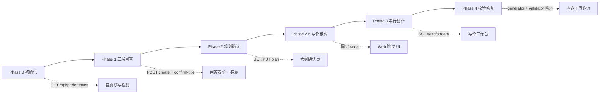
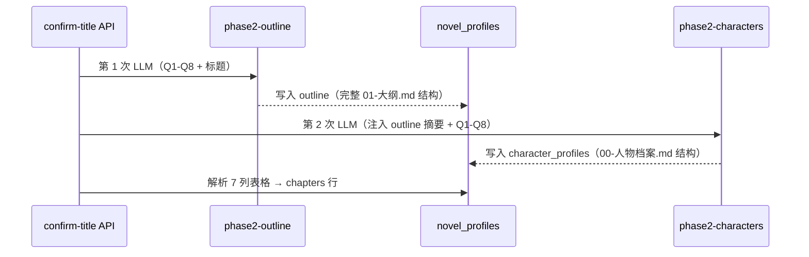

# Prompts 与 Novelist 流程对齐设计

> 文件路径：`docs/spec/prompts-design.md`
> 版本：1.1.0 · 日期：2026-05-29
> 状态：已定稿（用户决策 2026-05-29）
> 关联：`docs/novelist/SKILL.md`、`docs/spec/design.md`

---

## 1. 设计目标

将 Web 端作品生成逻辑与 `docs/novelist`（chinese-novelist skill v2）的**阶段流程、输出模版、LLM 提示词**对齐，并满足以下约束：

| 约束               | 说明                                                                                                          |
| ------------------ | ------------------------------------------------------------------------------------------------------------- |
| 提示词外置         | 所有 LLM 指令与输出骨架模版统一放在项目根目录 `prompts/`，禁止在 `lib/writer/*.ts` 内硬编码大段 Prompt        |
| 流程映射           | Web 仅实现 **串行写作**（已澄清，见 `analysis-report-2026-05-29.md`），不实现 subagent-parallel / agent-teams |
| 规格不变           | 不改变已定稿的 REQ-001～REQ-006 验收边界；对齐的是**实现方式**与**生成质量规范**                              |
| 参考保留           | `docs/novelist/references/` 继续作为人类可读的流程与写作技法说明；`prompts/` 为运行时加载源                   |
| **严格遵循 Skill** | 输出结构与写作规范以 `docs/novelist` 为唯一准绳；不引入 Skill 未定义的 DB 字段或简化模版                      |

### 1.1 已确认设计决策（2026-05-29）

| #   | 议题             | 决策                                                                                                                                                                                                                |
| --- | ---------------- | ------------------------------------------------------------------------------------------------------------------------------------------------------------------------------------------------------------------- |
| 1   | Phase 2 LLM 调用 | **分两次**：先 `phase2-outline` 生成 `01-大纲.md` 等价物，再 `phase2-characters` 生成 `00-人物档案.md` 等价物；第二次调用可读取第一次产出的大纲摘要                                                                 |
| 2   | 润色（去 AI 味） | **不纳入自动写作流**；仅对用户**手动选中**的正文片段调用 `phase3-chapter-polish`（阅读/编辑页触发）                                                                                                                 |
| 3   | 数据与模版       | **严格按照 Skill**：`novel_profiles.outline` 存完整 7 列大纲 Markdown；`character_profiles` 存符合 `character-template.md` 的结构化内容；**不新增** `outline_meta` 等扩展字段；章节规划从大纲表解析，不另造简化格式 |

---

## 2. Novelist 阶段 ↔ Web 产品映射



| Novelist 阶段 | Skill 参考文档                       | Web 入口                   | 数据落库                          |
| ------------- | ------------------------------------ | -------------------------- | --------------------------------- |
| Phase 0       | `phase0-initialization.md`           | `GET /api/preferences`     | `user_preferences`                |
| Phase 1 L1    | `phase1-layer1-core.md` (Q1-Q3)      | 创建表单 Step 1            | `novels.core_config`              |
| Phase 1 L2    | `phase1-layer2-customize.md` (Q4-Q8) | 创建表单 Step 2            | `novels.custom_config`            |
| Phase 1 L3    | `phase1-layer3-title.md`             | 标题候选 + `confirm-title` | `novels.title`, `status`          |
| Phase 2       | `phase2-planning.md`                 | `GET /api/novel/[id]/plan` | `novel_profiles`, `chapters`      |
| Phase 2.5     | `phase3-writing.md` §模式选择        | **无 UI**（固定 `serial`） | —                                 |
| Phase 3       | `phase3-writing.md` §逐章流程        | `write/stream` SSE         | `chapters.content`                |
| Phase 4       | `phase4-validation.md`               | 写作引擎内嵌               | `chapters.*_valid`, `retry_count` |

**与文件系统产物的对应关系**（Skill 本地项目目录 → DB）：

| Skill 文件              | Web 等价存储                                                  |
| ----------------------- | ------------------------------------------------------------- |
| `user-preferences.json` | `user_preferences.preferences`                                |
| `00-人物档案.md`        | `novel_profiles.character_profiles`（JSON）+ 导出时 Markdown  |
| `01-大纲.md`            | `novel_profiles.outline`（Markdown，含 7 列表格）             |
| `02-写作计划.json`      | `chapters` 表各行（`status`, `word_count`, `retry_count` 等） |
| `第XX章-标题.md`        | `chapters.content`（导出时套 `chapter` 模版）                 |

---

## 3. `prompts/` 目录结构（目标态）

```
prompts/
├── README.md                          # 变量约定、加载方式、与 novelist 对照索引
├── system/                            # 全局 System Instruction（角色人设）
│   ├── editor.md                      # 大纲/标题策划编辑
│   ├── author.md                      # 正文创作作者
│   └── reviewer.md                    # 悬念/质量审核
├── instructions/                      # 各阶段 User Prompt（含 {{变量}}）
│   ├── phase1-title.md                # 候选标题（3/5 个，含技巧说明）
│   ├── phase2-outline.md              # 7 列章节规划 + 全书悬念线
│   ├── phase2-characters.md           # 详细人物档案（可合并为单次调用）
│   ├── phase3-chapter-draft.md        # 写前分析 + 正文撰写（含黄金法则）
│   ├── phase3-chapter-polish.md       # 去 AI 味润色（仅手动选中片段，非自动流水线）
│   ├── phase3-chapter-rewrite.md      # 校验失败扩写/重写（携带 diagnostic）
│   └── phase4-suspense-check.md       # 末尾 300 字悬念判定
├── templates/                         # 输出骨架（非 LLM 指令，用于解析/导出）
│   ├── outline.md                     # ← novelist outline-template.md
│   ├── character.md                   # ← novelist character-template.md
│   ├── chapter.md                     # ← novelist chapter-template.md
│   └── export-novel.md                # 整本 Markdown 打包结构
└── fragments/                         # 可注入的写作技法摘录（可选）
    ├── golden-rules.md                # 三大黄金法则 + 展示而非讲述
    ├── hook-techniques-summary.md     # 章首引子七式 + 悬念钩子十三式（摘要）
    └── chapter-quality-checklist.md   # 张力/对话/意外转折检查项
```

### 3.1 变量命名约定

与 `data.md` 中 `core_config` / `custom_config` 字段对齐：

| 变量                         | 来源                          | Novelist 问题  |
| ---------------------------- | ----------------------------- | -------------- |
| `{{genre}}`                  | `core_config.genre`           | Q1             |
| `{{protagonist}}`            | `core_config.protagonist`     | Q2             |
| `{{conflict}}`               | `core_config.conflict`        | Q3             |
| `{{worldbuilding}}`          | `custom_config.worldbuilding` | Q4             |
| `{{perspective}}`            | `custom_config.perspective`   | Q5A            |
| `{{tone}}`                   | `custom_config.tone`          | Q5B            |
| `{{theme}}`                  | `custom_config.theme`         | Q6             |
| `{{audience}}`               | `custom_config.audience`      | Q7             |
| `{{chapterCount}}`           | `custom_config.chapterCount`  | Q8             |
| `{{title}}`                  | `novels.title`                | Layer 3        |
| `{{chapterNumber}}`          | 当前章                        | —              |
| `{{chapterTitle}}`           | `chapters.title`              | 大纲列         |
| `{{outlineRow}}`             | 7 列规划单行                  | 大纲表         |
| `{{characterProfiles}}`      | JSON/Markdown                 | 00-人物档案    |
| `{{previousChapterSummary}}` | 上一章摘要或末尾片段          | Phase 3 连贯性 |
| `{{diagnosticLog}}`          | `validation_log`              | Phase 4 修复   |

### 3.2 加载层设计（实现指引，非本期编码）

```
lib/prompts/
├── loader.ts          # 读取 prompts/ 文件，Mustache/简单 {{key}} 替换
├── types.ts           # PromptId 枚举、RenderContext 类型
└── index.ts           # getSystem(role), renderInstruction(id, ctx)
```

`lib/writer/planner.ts`、`generator.ts`、`validator.ts` 仅调用 `renderInstruction`，不内嵌 Prompt 字符串。

---

## 4. 各阶段 Prompt 与模版要点

### 4.1 Phase 1 · 标题生成 (`phase1-title.md`)

**对齐**：`phase1-layer3-title.md` + `title-guide.md`

- 输入：Layer 1/2 全部字段 + 用户偏好摘要（可选）
- 输出：3 个（简单题材）或 5 个（复杂题材）候选标题；每项含「技巧名 + 一句话说明」
- 解析：正则或 JSON 块提取 `candidateTitles[]`（与 `api.md` POST create 响应一致）

### 4.2 Phase 2 · 规划（两次 LLM 调用）

**对齐**：`phase2-planning.md`、`outline-template.md`（7 列）、`character-template.md`

**调用顺序（强制）**：



1. **`phase2-outline.md`（第 1 次）** — 产出须可直接存入 `novel_profiles.outline`，章节表为 Skill 规定的 **7 列**，并含「全书悬念线」「章节摘要区」占位（与 `outline-template.md` 一致）。
2. **`phase2-characters.md`（第 2 次）** — 输入包含第 1 次大纲全文或摘要；产出须符合 `character-template.md` 字段粒度（性格核心、致命缺陷、说话风格等），存入 `novel_profiles.character_profiles`。
3. **解析** — 仅从 `outline` 的 Markdown 表格拆行写入 `chapters`，不绕过 Skill 模版另生成简化提纲。

大纲 Prompt 必须要求输出：

| 列名         | 说明                     |
| ------------ | ------------------------ |
| 章节         | 第 N 章                  |
| 标题         | 章节标题                 |
| 核心事件     | 本章主事件               |
| 承接上章     | 悬念回应                 |
| 章首引子类型 | hook-techniques 七式之一 |
| 悬念钩子     | 结尾钩子类型/描述        |
| 出场人物     | 名单                     |
| 场景列表     | 简要场景                 |

人物档案 Prompt 必须要求：**性格核心、致命缺陷、说话风格、恐惧/弱项、背景** 达到可指导写作粒度（Skill 明确要求）。

**解析落库**：

- `novel_profiles.outline` ← **完整** `01-大纲.md` 等价 Markdown（禁止仅存简化章节列表）
- `novel_profiles.character_profiles` ← 符合 `00-人物档案.md` / `character-template.md` 的结构化 JSON（字段与 Skill 模版一一对应）
- `chapters` ← 从 7 列表格解析：`title`、以及 `outline_summary`（存**该行 7 列内容的规范化文本**，供 Phase 3 注入；运行时亦可从 `outline` 再解析，以保持与 Skill 读 `01-大纲.md` 一致）

### 4.3 Phase 3 · 章节创作（仅 `phase3-chapter-draft.md`，自动流）

**对齐**：`phase3-writing.md` 逐步流程

写前上下文（必须在 Prompt 中显式注入，与 Skill `phase3-writing.md` 步骤 1～2.5 一致）：

1. 从 `novel_profiles.outline` 解析的本章 **7 列完整规划行**（非简化摘要）
2. 出场人物档案摘录（来自 `character_profiles`，字段与 `character-template.md` 一致）
3. 上一章正文末尾或 `01-大纲.md` 中该章摘要区（串行连贯性）
4. `templates/chapter.md` 结构（章首引子 50-150 字、正文 3000-5000、章节备注区）

正文 Prompt 必须包含 Skill 质量约束（写入 `fragments/chapter-quality-checklist.md`）：

- 展示而非讲述；每章 ≥2 个张力波峰；对话占比 ≥30%
- 至少 1 处打破读者预期的转折
- 结尾使用「悬念钩子十三式」之一

**自动写作流不包含润色**：Skill Phase 3 步骤 9-10「深度润色」在 Web 端**不**由 `generator.ts` 自动执行，避免额外 LLM 成本与不可控的全章改写。自动流在初稿生成后直接进入 Phase 4 字数/悬念校验；未通过则走 `phase3-chapter-rewrite.md`。

### 4.4 手动润色（`phase3-chapter-polish.md`，用户触发）

**对齐**：`phase3-writing.md` 步骤 9-10 的写作规范，但执行时机改为**用户主动**。

| 项     | 说明                                                                                                      |
| ------ | --------------------------------------------------------------------------------------------------------- |
| 入口   | 阅读/编辑页（`/novel/[id]/read`）选中文本 →「润色选中内容」                                               |
| API    | `POST /api/novel/[id]/chapter/[chapterNumber]/polish`                                                     |
| 请求体 | `{ "selectedText": "...", "surroundingContext": "..." }`（`surroundingContext` 为选区前后各若干字，可选） |
| 响应   | `{ "polishedText": "..." }` — 由前端替换选区或展示 diff，**不自动覆盖**全文除非用户确认                   |
| Prompt | `phase3-chapter-polish.md` + `fragments/` 中去 AI 味检查清单（与 Skill 步骤 10 一致）                     |

关联需求：**REQ-006-AC-003**（见 `requirements.md`）。

### 4.5 Phase 4 · 校验 (`phase4-suspense-check.md` + 字数规则)

**对齐**：`phase4-validation.md`、`scripts/check_chapter_wordcount.py`

| 检查项         | 实现                                          | Prompt 需求                                   |
| -------------- | --------------------------------------------- | --------------------------------------------- |
| 字数 3000-5000 | 代码计数（与 Python 脚本规则一致）            | 无需 LLM                                      |
| 悬念钩子       | LLM 读末尾 300 字                             | `phase4-suspense-check.md`，仅返回 true/false |
| 失败重写       | `phase3-chapter-rewrite.md` + `diagnosticLog` | 最多 3 轮（REQ-005）                          |

---

## 5. 与现有实现 / 规格的差异（Gap Analysis）

### 5.1 代码层（已实现，待重构）

| 模块                      | 现状                                                             | 目标                                                                 |
| ------------------------- | ---------------------------------------------------------------- | -------------------------------------------------------------------- |
| `lib/writer/planner.ts`   | 内嵌简化 Prompt；`PlannerInput` 字段与 Q1-Q8 不一致；大纲非 7 列 | 改用 `prompts/instructions/phase2-*` + `core_config`/`custom_config` |
| `lib/writer/generator.ts` | 单行 Prompt + 弱 system                                          | 注入 7 列规划行、人设、上一章上下文；**不含**自动润色                |
| `lib/writer/validator.ts` | 悬念 Prompt 内嵌                                                 | 迁至 `phase4-suspense-check.md`                                      |
| `prompts/` 目录           | 不存在                                                           | 按 §3 创建                                                           |

### 5.2 规格文档

| 文件              | 问题                                | 建议修订                                         |
| ----------------- | ----------------------------------- | ------------------------------------------------ |
| `constitution.md` | 仍写「串行/并行」                   | 改为「仅串行自动写作」                           |
| `design.md`       | 未列出 `prompts/`、`lib/prompts/`   | 补充目录与 WriterEngine 依赖关系                 |
| `requirements.md` | 未显式引用 novelist 模版            | 在 REQ-003/004 增加**注释性**对齐说明（非新 AC） |
| `tasks.md`        | TASK-006～008 已完成但基于旧 Prompt | 新增 **TASK-006R** 重构任务（见下）              |
| `traceability.md` | 无 prompts 任务行                   | TASK-006R 合并到 006/007/008 追溯                |

### 5.3 有意不纳入 Web 的 Skill 能力

| Skill 能力                                  | Web 处理                                                 |
| ------------------------------------------- | -------------------------------------------------------- |
| Phase 2.5 写作模式选择                      | 固定 `serial`，无 API 字段                               |
| 子 Agent / Agent Teams 并行                 | 不实现                                                   |
| 本地 `chinese-novelist/{timestamp}/` 文件夹 | 全部由 DB + 导出 API 替代                                |
| Phase 3「禁止向用户确认」                   | Web 在规划阶段确认一次，写作阶段全自动（REQ-004 已覆盖） |

---

## 6. API / 数据模型对齐检查

当前 `api.md` + `data.md` **无需结构性变更**，仅需实现层按 Prompt 输出解析：

| API                           | Prompt 阶段                                          | 备注                                                                         |
| ----------------------------- | ---------------------------------------------------- | ---------------------------------------------------------------------------- |
| `POST /api/novel/create`      | `phase1-title`（仅标题）                             | 与 `confirm-title` 后触发的 `phase2` 拆分，符合 Skill Layer 3 → Phase 2 顺序 |
| `POST .../confirm-title`      | **两次**异步：`phase2-outline` → `phase2-characters` | 顺序执行，失败则 `planning` 置 `failed`                                      |
| `GET .../plan`                | —                                                    | 返回完整 `outline` Markdown + `characterProfiles` + 从表解析的 `chapters[]`  |
| `GET .../write/stream`        | `phase3-draft` + `phase4` 循环                       | SSE 事件不变；**无**自动 polish 事件                                         |
| `POST .../chapter/[n]/polish` | `phase3-chapter-polish`                              | 仅选中片段；见 §4.4                                                          |

**数据模型（严格 Skill，已否决扩展字段）**：不新增 `outline_meta`。规划 UI 展示 7 列时，从 `novel_profiles.outline` 解析 Markdown 表格；与 Skill 读 `01-大纲.md` 的方式一致。

---

## 7. 任务拆分建议（纳入 `tasks.md`）

在 **TASK-010 之前**插入 Prompt 层重构（阻塞后续 API/UI 质量）：

| 任务 ID         | 名称                                  | 交付物                                                |
| --------------- | ------------------------------------- | ----------------------------------------------------- |
| **TASK-006R**   | Prompts 目录与加载器                  | `prompts/**`、`lib/prompts/loader.ts`、单测           |
| **TASK-006R-b** | 重构 planner：Phase 2 两次调用        | `generateOutline()` + `generateCharacters()` 顺序执行 |
| **TASK-007R**   | 重构 validator 外置 Prompt            | `validator.ts`                                        |
| **TASK-008R**   | 重构 generator 对齐 Phase 3/4         | 写前上下文、重写 Prompt（**无**自动润色）             |
| **TASK-012a**   | 手动润色 API + `lib/writer/polish.ts` | `POST .../polish`，REQ-006-AC-003                     |

验收：Vitest 使用 **fixture 快照** 断言 `renderInstruction` 输出包含关键约束句；planner 解析测试含 7 列表格样例。

---

## 8. 测试策略补充

| 类型 | 新增关注点                                                     |
| ---- | -------------------------------------------------------------- |
| Unit | `lib/prompts/loader` 变量替换；planner 解析 7 列 Markdown 表格 |
| Unit | generator mock LLM 时传入的 prompt 含 `chapterCount`、人物摘录 |
| E2E  | 不变；仍按 REQ AC 验证 UI/API                                  |
| 回归 | 导出 Markdown 结构符合 `templates/export-novel.md`             |

---

## 9. 文档变更清单（本次对齐）

| 文件                          | 变更                                             |
| ----------------------------- | ------------------------------------------------ |
| `docs/spec/prompts-design.md` | **新建**（本文件）                               |
| `docs/spec/design.md`         | 补充 `prompts/`、`lib/prompts/`、Writer 依赖说明 |
| `docs/spec/constitution.md`   | 删除「并行」表述                                 |
| `docs/spec/tasks.md`          | 插入 TASK-006R 系列                              |
| `docs/spec/requirements.md`   | REQ-003/004 增加 novelist 对齐注释（可选）       |

---

## 10. 已确认决策记录

| #   | 用户选择                | 规格影响                                                                                            |
| --- | ----------------------- | --------------------------------------------------------------------------------------------------- |
| 1   | Phase 2 **分两次** LLM  | `planner.ts` 拆为 outline / characters 两步；`confirm-title` 后台任务串行                           |
| 2   | 润色仅 **手动选中内容** | `generator` 不调用 polish；新增 polish API + 阅读页 UI；REQ-006-AC-003                              |
| 3   | **严格按照 Skill**      | 模版与 `docs/novelist/references/guides/` 对齐；`outline` 存完整 7 列 Markdown；否决 `outline_meta` |

---

_本文档为设计对齐产物，不包含应用代码实现。_
